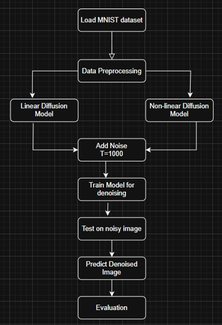

# Investigating the Impact of Linear and Non-Linear Diffusion Models in Image Synthesis

This project explores how different noise schedules—**linear** and **cosine (non-linear)**—affect the performance of Denoising Diffusion Probabilistic Models (DDPMs) in image synthesis using the MNIST dataset.

## Motivation

Diffusion models offer strong generative capabilities, but the effectiveness of the denoising process largely depends on the chosen noise schedule. This project compares the traditional linear schedule with a cosine-based non-linear schedule to evaluate their impact on image quality and diversity.

## Objectives

- Implement DDPM using linear and cosine noise schedules.
- Train a U-Net model to perform denoising.
- Evaluate outputs using metrics such as MSE, SSIM, PSNR, and LPIPS.
- Compare sample diversity and reconstruction quality.

## Dataset

- **MNIST** (28×28 grayscale digits)
- Used for both forward diffusion and reconstruction evaluation.

## Methodology

- **Forward Diffusion**: Add noise to images over 1000 steps.
- **Noise Schedules**:
  - Linear: β increases linearly.
  - Cosine: Smooth decay to preserve structure.
- **Model**: Identical U-Net architecture for both schedules.
- **Training**: 50 epochs using the Adam optimizer.
- **Sampling**: Reverse denoising from noise to image.

## Results

- **LPIPS (Diversity)**: Cosine (0.346) > Linear (0.230)
- Cosine schedule produces clearer, sharper digits with better structural retention.
- Quantitative improvements observed across all metrics (SSIM, PSNR, MSE).

## 📜 License

This project is licensed under the MIT License. See the [LICENSE](LICENSE) file for more details.

